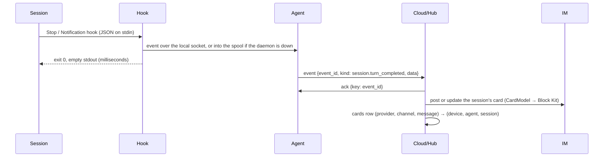

# forgeline Cloud + forgeline-agent: driving coding agents on your own machines from chat

> **Implementation source of truth** for Epic [#48](https://github.com/angelozhangai/forgeline/issues/48).
> Every phase issue (#49–#59) points here; when an implementation and this document disagree, one of them
> is a bug and the PR that resolves it says which. Engineering discipline: [../AGENTS.md](../AGENTS.md).
> Related: [architecture-control-plane-split.md](architecture-control-plane-split.md) (the control plane /
> runner split this builds the transport and trust layer for) and
> [pluggable-messaging-and-doc-sources.md](pluggable-messaging-and-doc-sources.md) (`MessagingPort`, `CardModel`).
>
> Status: **P0 — this document.** The wire protocol is pinned by golden fixtures in
> [fixtures/wire/v1/](../fixtures/wire/v1/), generated and verified by
> [tools/wire-fixtures.ts](../tools/wire-fixtures.ts) and [test/wire-fixtures.test.ts](../test/wire-fixtures.test.ts).

---

## 0. What this is

From Slack (Feishu later), with nothing but chat, the owner can:

1. get a card when a Claude Code / Codex / Cursor session on one of their machines finishes a turn or needs a human;
2. reply under that card and have the reply delivered into **that session on that machine**, which continues;
3. start a new session on a chosen machine and repository;
4. allow or deny a pending permission request.

Three pieces, and nothing else:

```
Slack / Feishu ──HTTPS events, signed by the IM──▶ forgeline Cloud (Cloudflare Worker, cloud/)
                                                     • verifies the IM's signature, obeys only the bound owner
                                                     • DeviceHub Durable Object per device: WebSocket, presence, job queue
                                                     • D1: devices, sessions, cards, jobs, audit
                                                               ▲
                                                               │ WebSocket, dialled out by the device; every frame signed
                                                               │
forgeline-agent (Rust, agent/), resident on each machine ──────┘
  • hook entry points for Claude / Codex / Cursor (return in milliseconds, exit 0, empty stdout)
  • a fixed set of typed actions, gated by a local policy the cloud can read but never change
```

M1 reaches parity with a working single-machine prototype (a hook script plus per-machine Slack polling that
lives in a downstream workstation repository since 2026-10) and replaces it. Section 12 maps phases to sections.

---

## 1. Settled decisions

These are the Epic's decisions, restated as constraints on the implementation. Changing one is a change to
this document first.

| # | Decision | Consequence for the code |
| --- | --- | --- |
| D1 | **Lives in this repo**: `agent/` (Rust) and `cloud/` (Worker). The core under `src/` does not change for M1/M2 | `test/arch-boundary.test.ts` grows two rules: `src/` never imports `cloud/` or `agent/`; `cloud/` imports from `src/` only what is runtime-neutral and provider-neutral (§11.3) |
| D2 | **The cloud owns the IM ingress**: Events API + interactivity over HTTPS. No Socket Mode, no polling | Exactly one ingress per deployment. Devices never hold an IM token (§4.4) |
| D3 | **Devices only dial out**: one Durable Object per device holds a hibernatable WebSocket | No listening port on any device; the only local listener is a Unix socket for hooks (§8.3) |
| D4 | **Mutual authentication on every connection and every frame**: Ed25519 device keys, a pinned cloud key, challenge–response, nonces, timestamps, idempotency keys, revocation, rotation | §5 and §9 |
| D5 | **A fixed set of typed actions, never a shell.** Allowlists live in the device's local config | §6. The cloud can *see* the policy (the device reports it) so it can refuse early with a clear message, but the device decides |
| D6 | **Devices send provider-neutral events; the cloud renders per provider** | Events carry facts (§7), never Block Kit. Rendering reuses `CardModel` |
| D7 | **Only the bound owner is obeyed**; instructions older than 15 minutes are not executed; every step is audited | §4.2, `expires_at` (§5.8), the `audit` table (§10) |
| D8 | **A dedicated Cloudflare account**, never inside a product's infrastructure | Same reasoning as the two-repo decision in the split doc; also bounds T4 in §4. This repo is public: no account id, database id or hostname is committed — deploy-time configuration supplies them |
| D9 | **Devices do not independently re-verify instructions with the IM provider in M1** — decided in §4.4 | The signed job carries the IM `origin`, so a device-side verifier can be added later without a protocol change |

---

## 2. Components and repository layout

```
agent/                      Rust crate `forgeline-agent` (one binary, plus a lib target for tests)
  Cargo.toml, Cargo.lock    MSRV pinned with `rust-version`; dependencies listed in §11.1
  src/                      daemon, hook entry points, wire, actions, policy, keystore, CLI
  tests/                    integration tests; consume ../fixtures/wire/v1 directly
cloud/                      Cloudflare Worker, TypeScript, its own package.json and lockfile
  wrangler.jsonc            `dev` and `prod` environments, both in the dedicated account (D8)
  src/                      Worker entry, DeviceHub Durable Object, providers/slack, wire, audit
  migrations/               D1 migrations (§10.1)
  test/                     vitest on workerd (@cloudflare/vitest-pool-workers); consume ../fixtures/wire/v1
fixtures/wire/v1/           golden protocol fixtures — generated, never hand-edited (§5.10)
tools/wire-fixtures.ts      the reference framing implementation and the fixture generator
docs/cloud-agent.md         this document
```

The root `npm run ci` keeps its meaning (the core). `cloud/` and `agent/` get their own CI jobs (§11.4), and a
change to `fixtures/wire/` must keep all three green: the reference test, the Worker's, and the agent's.

---

## 3. Flows

Participants: **Owner** (the human, in the IM), **IM** (Slack or Feishu), **Cloud** (Worker + D1),
**Hub** (the device's Durable Object), **Agent** (`forgeline-agent` daemon), **Hook** (a short-lived
`forgeline-agent hook …` / `wait …` process started by the coding agent), **Session** (the Claude Code /
Codex / Cursor session).

### 3.1 Connect

```mermaid
sequenceDiagram
  participant A as Agent
  participant H as Hub (Durable Object)
  A->>H: WebSocket upgrade  wss://<cloud>/v1/devices/<device_id>/connect
  H->>A: challenge {nonce_c, versions:[1]}            (signed: cloud key)
  A->>H: auth {challenge: nonce_c, nonce: nonce_d, version, agent, capabilities, policy}   (signed: device key)
  H->>A: welcome {nonce: nonce_d, conn, heartbeat_s, jobs_enabled}   (signed: cloud key)
  Note over A,H: both keys proven on this connection; queued jobs are delivered now
  loop every heartbeat_s
    A->>H: "ping"   (literal text frame, auto-answered without waking the Hub)
    H-->>A: "pong"
  end
```

Any verification failure: the receiver sends a signed `error` if it can, closes with the code in §5.9, and records it.
Refusals of an **authenticated** device (revoked, replay, wrong recipient, …) go to the D1 `audit` table. Refusals that
prove nothing about any device — unknown device id, unknown key, bad signature before authentication — go to the
Worker's logs and counters only: auditing them in D1 would let anyone on the internet write rows.
A device that is unknown, pending or revoked never gets past `auth`.

### 3.2 Notification (M1, P5)



### 3.3 Reply into a session (M1, P6)

```mermaid
sequenceDiagram
  participant O as Owner
  participant I as IM
  participant C as Cloud/Hub
  participant A as Agent
  participant W as Waiter hook
  participant S as Session
  O->>I: reply in the card's thread
  I->>C: event (signed by the IM)
  C->>C: verify IM signature · sender == bound owner · thread parent is a known card · not older than 15 min
  C->>A: job session.reply {agent, session, text}  (signed, expires_at = sent + 15 min)
  A->>C: ack
  A->>A: policy: action enabled · agent enabled · session reported by this device recently
  alt a waiter is attached to that session (Claude, open and idle)
    A->>W: deliver the text
    W-->>S: exit 2 + the text on stderr → the session wakes and runs it
  else the session is open and busy
    A->>A: hold it; delivered at the next Stop
  else the session is closed (Claude)
    A->>S: claude --resume <id> --bg "<text>"
  else Codex
    A->>S: codex queue --thread <id> --message=<text>
  end
  A->>C: result {status, code, message}
  C->>I: reaction / thread note on the owner's reply
```

The waiter is a second Claude Code `Stop` hook with `asyncRewake: true` (`forgeline-agent wait claude`). It is the
only entry point whose exit code is not always 0. The facts this flow rests on are in the Epic's table and are
encoded in the prototype's spec; the ones that shape code here:

- the woken turn is framed to the model as a background notification, **not** user input — the delivered text
  must say who sent it and from where, and must never be disguised as typed input;
- Claude does not cancel a waiting async hook when the user types locally — the agent cancels the waiter on
  `UserPromptSubmit`, or a stale reply is injected later;
- under `claude -p`, `asyncRewake` runs synchronously — the waiter only waits when
  `CLAUDE_CODE_SESSION_ATTENDED=1`, and fails closed if the variable is absent;
- `claude --bg` refuses a directory whose workspace trust was never accepted — reported as `untrusted_workspace`,
  surfaced by `forgeline-agent doctor`.

### 3.4 Start a session (M2, P7)

The owner writes an explicit command on the main line of the DM: `run <repo> <task>` (or `run <repo> on <device>
<task>`, or a pasted issue / PR link). The cloud resolves the device (the only one, the default one, or the one
named), refuses early if the device's reported policy cannot allow it, and sends `session.start {agent, repo,
prompt}`. `repo` is an **alias from the device's config**, never a path: the cloud cannot name a directory. The
agent starts a background session and returns its id; the cloud posts a card for it, and from then on it behaves
like any other session (§3.2, §3.3). A session started this way can be opened in the IDE later; the IDE's
`?prompt=` deep link only pre-fills and never submits, which is why the session is started in the background
rather than in an editor.

### 3.5 Remote permission approval (M2, P8)

A `PermissionRequest` hook (`forgeline-agent hook claude`) asks the daemon over the local socket and blocks for at
most the request's own timeout. The daemon sends `permission.requested {request_id, tool, summary,
expires_at}`; the cloud posts a card with Allow / Deny; the owner's click becomes `permission.answer
{request_id, decision}`; the daemon hands the decision to the waiting hook, which prints it as the hook's
decision JSON. No answer in time → the hook prints nothing and the session falls back to asking locally. A
`PermissionRequest` hook's stdout *is* its decision, so this is the one hook whose stdout is not empty — and it
is never anything but a decision the owner made.

### 3.6 Enrolment (P2)

```mermaid
sequenceDiagram
  participant D as forgeline-agent enroll
  participant C as Cloud
  participant O as Owner
  D->>D: generate Ed25519 key (keychain / 0600 file)
  D->>C: POST /v1/enroll {name, public_key, agent, policy}
  C->>D: {device_id, code (one-time, 10 min), cloud_keys}
  D->>O: prints code + device key fingerprint + cloud key fingerprint
  O->>C: "enroll <code>" in the DM (before P4: owner-authenticated admin endpoint)
  C->>O: "Enrolled <name>, key <fingerprint>. Cloud key <fingerprint>."
  D->>C: poll GET /v1/enroll/<device_id> (signed with the new key) until confirmed
  D->>D: pin cloud_keys, write device_id; start the daemon
```

The code proves the person typing in chat can read the device's terminal; the owner check proves it is the owner.
Codes are stored hashed, expire in 10 minutes, allow 5 attempts, and are single-use. The cloud key is pinned on
first use over TLS, and the owner can compare its fingerprint in the chat confirmation with the one the device
printed.

---

## 4. Threat model

### 4.1 Assets

| Asset | Where | Why it matters |
| --- | --- | --- |
| A1 — the ability to make a coding agent act on a device | every device | The agent has tool permissions in real repositories. This is the asset everything else protects |
| A2 — repositories and local credentials (gh, cloud CLIs, keys) | every device | Reachable through A1; never sent to the cloud |
| A3 — IM credentials (bot token, signing secret) | Worker secrets | Post as the app; forge nothing inbound (the signing secret only verifies) |
| A4 — the cloud signing key | Worker secret | Signs jobs; whoever holds it can drive A1 within each device's policy |
| A5 — device private keys | macOS Keychain; 0600 file on Linux | Impersonate one device: send it events, receive its jobs |
| A6 — content: turn summaries, reply text | transits the cloud and the IM | May contain code or accidentally pasted secrets |
| A7 — the audit trail | D1, plus each device's local log | Lets the owner reconstruct what ran and why |

### 4.2 Actors

| Actor | Trust |
| --- | --- |
| Owner | Trusted. The only human whose words become jobs |
| IM provider | Trusted for identity: "this message was written by user U in workspace W" |
| Cloud (Worker + D1 + Durable Objects) | Trusted for routing and owner authentication; its power is bounded by each device's local policy (§4.4) |
| One device | Trusted for itself only; a device key signs only for its own device id |
| T1 — internet attacker who knows the Worker URL | Untrusted |
| T2 — attacker holding the owner's IM session | Indistinguishable from the owner (residual, §4.3) |
| T3 — other members of the IM workspace, other workspaces | Untrusted; their messages are never instructions |
| T4 — attacker controlling the Cloudflare account or the deployed Worker | Untrusted; the design bounds what this can reach |
| T5 — attacker holding one device's key | Untrusted beyond that device |
| T6 — network attacker, including TLS-intercepting proxies | Untrusted |
| T7 — another local user on a device | Untrusted |

### 4.3 Threats and mitigations

| # | Threat | Mitigation | Residual |
| --- | --- | --- | --- |
| 1 | T1 forges an IM event to the Worker | Verify the IM's request signature (Slack: HMAC-SHA256 `v0` over timestamp + body, 5-minute window, constant-time compare) before parsing anything | — |
| 2 | T3 or a bot writes something that looks like an instruction | Obey only the bound owner's `(workspace, user)`; ignore bot messages and edits; act only on thread replies under a known card, or on an explicit main-line command (`run …`) | — |
| 3 | T1 connects a WebSocket with a stolen URL | Challenge–response with the device's enrolled key; unknown, pending and revoked devices refused before `welcome`; `prod` has no unauthenticated path at all, by construction (P1 test) | — |
| 4 | T6 replays captured frames | Per-frame `ts` window (±5 min) and per-sender id cache; handshake nonces from both sides bind auth to the connection; `to` binds every frame to one recipient | — |
| 5 | T6 modifies a job in flight | Every frame is Ed25519-signed over its canonical bytes; the device pins the cloud's keys and verifies before parsing the body | — |
| 6 | T5 uses a stolen device key | Revocation is immediate (open socket closed, key refused). The key signs only for its own device: it cannot address other devices or receive their jobs. It can send fake events to the owner → card text is rendered as untrusted text (no mentions, no unfurling) | Fake notifications from that device until revoked |
| 7 | T4 controls the cloud | Can send any **typed** job any device's policy allows: inject text into sessions that device reported, start sessions in allowlisted repos (M2), answer pending permission requests (M2), pause devices. **Cannot** run a shell, name a path, widen a policy, address an unreported session, or lift a pause. Mitigated by D8 (dedicated account, hardware-key 2FA, scoped API tokens, nothing else deployed there), by narrow device policies, and by the device's own log of every job it ran | Within each device's policy, the cloud is as powerful as the owner. See §4.4 |
| 8 | T2 has the owner's IM session | 15-minute instruction expiry; `pause` from any device; narrow policies | Accepted: T2 *is* the owner as far as any IM-driven system can tell |
| 9 | T7 talks to the agent's Unix socket | Socket in a 0700 directory, and peer credentials checked (same uid) on every connection | Same-user malware already owns the machine; out of scope |
| 10 | Flooding: jobs or events in volume | Per-device and per-owner rate limits in the cloud; a local limit on jobs per hour; bounded queues; bounded frame and text sizes (§5.11) | — |
| 11 | A6 leaks through storage | D1 stores metadata only: jobs store a SHA-256 of their params, events store their kind. Bodies live in the Hub only until delivered or expired | The IM itself keeps what was posted, as it does today |
| 12 | Clock skew makes a device reject everything | ±5-minute window; `welcome` is dated by the cloud, so `doctor` reports skew in words | — |
| 13 | Version downgrade | Exactly one version (1) is accepted; the version is inside the signed bytes; there is no fallback | — |
| 14 | Enrolment hijack | One-time code shown on the device and typed by the owner in chat; hashed, 10-minute, 5 attempts, single use; fingerprints shown on both sides | — |

### 4.4 Decision: devices do not re-verify instructions with the IM in M1

**Question (Epic decision 9):** should each device, before acting, independently ask the IM provider "did the owner
really write this?" — so that even a compromised cloud (T4) cannot drive it?

**Decision: no, not in M1.** The cloud is trusted for owner authentication, and its power is bounded by the
device's local policy (threat 7). Reasons:

1. **It defends against exactly one actor, T4**, and T4 is already bounded: typed actions only, no paths, no policy
   changes, only sessions the device itself reported, no un-pausing.
2. **It needs an IM read credential on every device.** For Slack that is a token able to read the owner's whole DM
   history with the app; on Feishu the equivalent app credential can do much more. N devices holding it is a new
   asset with its own exposure — the opposite of D2, whose point is that devices hold no IM credential at all.
3. **It reintroduces per-device, per-provider IM code**, which is the part of the prototype this design deletes.

**What keeps the door open:** every job carries `origin` (provider + message reference) **inside the signed
body**. A device-side verifier can therefore be added later as an opt-in local policy (`[verify] origin =
"slack"`) with no protocol change.

**Revisit when:** the cloud stops being operated by the device owner (hosted, multi-tenant). From then on the
operator is a third party, and re-verification — or instructions signed by a key only the owner holds — becomes
a requirement, not an option.

### 4.5 Red lines (machine-guarded where possible)

- Never auto-merge (unchanged).
- Never execute arbitrary shell from chat; only the typed actions of §6.
- Never act on a message that is not from the bound owner; never act on main-line chatter without an explicit command.
- The cloud can never widen a device's local policy, and can never lift a local pause.
- Fail closed: any verification or state-detection failure means *do nothing and say why* — to the owner, in chat.
- Never disguise forwarded text as the user typing; it is framed as a notification that says where it came from.

---

## 5. Wire protocol v1

### 5.1 Transport

One WebSocket per device, dialled by the device to `wss://<cloud>/v1/devices/<device_id>/connect`, terminated by
that device's `DeviceHub` Durable Object (`idFromName(device_id)`). Text frames only. A newer connection for the
same device replaces the older one (closed with 4005). Every frame is a JSON envelope (§5.2), **except** the two
literal liveness frames `ping` (device → cloud) and `pong` (cloud → device): the Hub answers them with a
WebSocket auto-response so a hibernated Durable Object is not woken every 30 seconds. They carry no data and can
trigger nothing, so signing them would add nothing.

### 5.2 Envelope

```json
{
  "v": 1,
  "type": "job",
  "id": "01M423BN0RBT69J0H0FBXEPW90",
  "ts": 1791071999000,
  "from": "cloud",
  "to": "dev_01M3ZGYZ00MZDA2E2C003XDNC6",
  "kid": "If4x36FUomFia_hU",
  "re": "…optional…",
  "body": { "…": "…" },
  "sig": "…86 base64url characters…"
}
```

| Field | Rule |
| --- | --- |
| `v` | Integer; exactly `1` |
| `type` | One of §5.6 |
| `id` | ULID (26 Crockford base32 characters), unique per sender. It is the nonce |
| `ts` | Integer milliseconds since the epoch, sender's clock, set when the frame is sent |
| `from`, `to` | `cloud` or a device id: `dev_` + ULID |
| `kid` | Key id of the signer: the first 16 characters of base64url(SHA-256(raw 32-byte public key)). It is also the fingerprint humans compare |
| `re` | Optional: the `id` of the frame this one answers |
| `body` | Object; its schema depends on `type` |
| `sig` | base64url (no padding) of the 64-byte Ed25519 signature: 86 characters, the last of which is `A`, `Q`, `g` or `w` (its four unused bits are zero — lenient decoders ignore them, strict ones refuse them, so the rule keeps the two in agreement) |

The envelope is closed: an unknown top-level field is `malformed`. Extensions go in `body`.

### 5.3 Canonical form and signing

- **Canonical form**: RFC 8785 (JCS), restricted so its two hard parts never arise — numbers must be safe
  integers (|n| ≤ 2^53 − 1; no fractions, no exponents) and object keys must be printable ASCII. Strings are
  escaped exactly as ECMAScript `JSON.stringify` escapes them; lone surrogates are refused.
- **The frame text must be byte-identical to its own canonical form.** Parse, canonicalise, compare. This makes
  parser differences irrelevant — duplicate keys, whitespace, alternative escapes, `1e3` — because no honest
  sender ever produces a frame where two parsers could disagree.
- **Signing input**: the UTF-8 bytes of `"forgeline-wire/1\n"` followed by the canonical form of the envelope
  **without** `sig`. The prefix separates this protocol's signatures from any other use of the same key.
- Keys, signatures and nonces are base64url without padding, with unused trailing bits zero. Nonces are 32 random bytes
  (43 characters).

### 5.4 Verification order

A receiver runs these checks in this order and rejects with the first that fails. The order is part of the
protocol: a frame that is wrong in two ways must get the same code everywhere, or the audit trails disagree.

| # | Check | Code |
| --- | --- | --- |
| 1 | A text frame of at most 65 536 UTF-8 bytes, nested at most 32 deep (the envelope is depth 1) — both checked on the raw text, before parsing; parses as a JSON object; `v` is an integer | `malformed` |
| 2 | `v` == 1 | `unsupported_version` |
| 3 | Field set and field formats (§5.2) | `malformed` |
| 4 | Canonicalisable (integers, ASCII keys, no lone surrogates) | `malformed` |
| 5 | Text == canonical form | `non_canonical` |
| 6 | `kid` is trusted **and** belongs to `from` | `unknown_key` |
| 7 | Signature verifies | `bad_signature` |
| 8 | `to` == self | `wrong_recipient` |
| 9 | \|now − `ts`\| ≤ 300 000 ms (inclusive) | `stale` |
| 10 | `(from, id)` not seen in the window | `replay` |

Only frames that pass 6–7 reach 8–10, so those codes are facts about an authenticated sender. The receiver's
keyring decides what "trusted" means: a device trusts only the cloud keys it pinned; a Hub trusts only the keys
of its own device.

What happens to a rejected frame **after** the handshake: `malformed` and `non_canonical` close the connection with
4000 (the peer is broken or hostile, and nothing it sends can be trusted to be framed right). Every other code —
`unknown_key`, `bad_signature`, `wrong_recipient`, `stale`, `replay` — drops that one frame, records it, and keeps
the connection without replying: a replayed or misaddressed frame is evidence of something wrong in the path, not
of the peer, and answering it helps neither a bug nor an attacker.

### 5.5 Handshake

| Frame | Direction | Body |
| --- | --- | --- |
| `challenge` | cloud → device | `nonce` (32 bytes), `versions` (`[1]`) |
| `auth` | device → cloud, `re` = challenge | `challenge` (the cloud's nonce, echoed), `nonce` (the device's), `version`, `agent` {`version`, `os`, `arch`}, `capabilities` (action kinds it implements), `policy` (§8.2 summary) |
| `welcome` | cloud → device, `re` = auth | `nonce` (the device's, echoed), `conn` (connection id), `heartbeat_s`, `jobs_enabled` |

Until `welcome`, the only frames either side accepts are the next handshake frame and `error`.

### 5.6 Message types

| Type | Direction | Body | Answered by |
| --- | --- | --- | --- |
| `challenge`, `auth`, `welcome` | §5.5 | §5.5 | the next handshake frame |
| `event` | device → cloud | `event_id` (ULID, idempotency key), `kind` (§7), `at`, `data` | `ack` |
| `job` | cloud → device | `job_id` (ULID, idempotency key), `kind` (§6), `attempt`, `issued_at`, `expires_at`, `origin` {`provider`, `ref`}, `params` | `ack`, then `result` |
| `ack` | both | `key` — the `event_id` or `job_id` now durably stored by the receiver; `re` = the acknowledged frame | — |
| `result` | device → cloud, `re` = the job frame | `job_id`, `status` (`done` / `rejected` / `failed`), `code` (§6.2), `message` (English, written for the owner), optional `data` | `ack` |
| `error` | both | `code` (a §5.4 code, or `auth_failed`, `revoked`, `unknown_device`, `replaced`), `message`; sent just before closing | — |

### 5.7 Delivery

- **At least once, idempotent.** Events and jobs are retried until acknowledged; receivers deduplicate by
  `event_id` / `job_id`. Each attempt is a **new envelope** (new `id`, new `ts`, new signature) carrying the same
  idempotency key. Envelope ids are for replay protection; idempotency keys are for deduplication. They are
  different things.
- **Events**: the device writes each event to a local spool before sending and deletes it on `ack`. Hooks write to
  the spool directly when the daemon is down, so nothing is lost across restarts.
- **Jobs**: the Hub persists queued jobs in Durable Object storage and redelivers on reconnect, or 30 s after an
  unacknowledged attempt. The device records each `job_id` in a local journal **before** acknowledging it, re-acks
  duplicates, and re-sends the stored `result` for duplicates that already ran. A journal entry is kept until it is
  both 24 h past receipt **and** past `expires_at`: receipt is the device's clock and expiry the cloud's, and keeping
  only one of the two would leave a gap the size of the clock skew.
- **Delivery is at least once; execution is at most once.** A job that was journaled but had not finished when the
  device stopped is never run again: a redelivery is answered `failed` / `internal` with "the outcome is unknown; it
  was not run again". A reply typed into a session twice is worse than one the owner has to resend.
- **No ordering** is promised across jobs. Two replies to the same session are applied in `issued_at` order.

### 5.8 Expiry and offline devices

- Every job has `expires_at`. For instructions that come from chat it is `issued_at` + 15 minutes, where
  `issued_at` is when the owner *sent* the message, not when the cloud got around to it (D7).
- A job may start while now < `expires_at`; from `expires_at` on it is expired (the bound is exclusive for running,
  inclusive for expiry — the Hub's alarm and the device agree). A device refuses an expired job (`rejected` /
  `expired`), even one it received in time but could not start.
- `expires_at` − `issued_at` is at most 24 hours, the device journal's retention (§5.7): a longer-lived job could
  outlive its own deduplication record and run twice. A device rejects anything longer as `invalid_params`.
- A job that expires undelivered is marked `expired` by the Hub, and the owner is told in chat which device was
  offline and that nothing ran. **Never silently dropped.**
- A job that was acknowledged but has no `result` after its kind's timeout is marked `unknown` and reported the same
  way: "delivered, outcome unknown" is different from "not run", and the owner must be able to tell them apart.

### 5.9 Close codes

| Code | Meaning |
| --- | --- |
| 4000 | Protocol error: any rejection during the handshake; `malformed` / `non_canonical` after it; a binary frame; an oversized frame; anything but the next handshake frame before `welcome` |
| 4001 | Authentication failed |
| 4003 | Device revoked |
| 4004 | Unknown device |
| 4005 | Replaced by a newer connection for the same device |
| 4009 | Unsupported version |

After 4001, 4003, 4004 and 4009 the agent does **not** reconnect in a loop: it stops, logs, and `status` / `doctor`
say why. The same goes for 4005 arriving on the agent's **current** connection: something else is connected with this
device's key — a second daemon, or a copied key — and reconnecting would make the two replace each other forever.
(4005 on a connection the agent has already abandoned is just the cloud tidying up, and is ignored.) Anything else: reconnect with full-jitter exponential backoff, 1 s doubling to a 60 s cap, reset after a
connection that lasted 5 minutes.

### 5.10 Golden fixtures

[fixtures/wire/v1/](../fixtures/wire/v1/) holds `keys.json` (the RFC 8032 test vectors — test-only, public),
`canonical.json` (canonicalisation cases), and `frames/*.json`: each one a receiver, a clock, a keyring, raw frames
fed in order, and the expected verdict per frame — every message type, every rejection code, and frames that are
wrong in two ways at once (`order-*`), which are what pin the *order* of §5.4. The files are
generated by `node tools/wire-fixtures.ts --write` and **never hand-edited**; `test/wire-fixtures.test.ts` fails
when the files and the generator drift. `cloud/` and `agent/` each run their own verifier over the same files.

### 5.11 Limits

| Limit | Value |
| --- | --- |
| Frame size | 64 KiB (65 536 UTF-8 bytes) |
| Nesting depth | 32, the envelope being 1 |
| `params.text` / `prompt` | 4 000 characters (Unicode code points, as Rust's `chars()` counts them) |
| Event `summary` | 2 500 characters (the device truncates) |
| Pending jobs per device in the Hub | 100 |
| Jobs per device per hour | cloud: 60; device: `limits.jobs_per_hour` (§8.2), whichever is lower |
| Replay cache | ids seen in the last 10 minutes |

### 5.12 Versioning

Version 2, if it ever exists, gets a new signing prefix (`forgeline-wire/2`) and is offered in `challenge.versions`.
A device chooses the highest version both support, inside its signed `auth`. There is no unsigned negotiation and
no downgrade below what both sides support.

---

## 6. Typed actions (jobs)

### 6.1 Catalogue

| Kind | Phase | Params | Gate on the device |
| --- | --- | --- | --- |
| `session.reply` | P6 | `agent` (`claude` / `codex` / `cursor`), `session` (the agent's session id), `text` | `actions."session.reply"`; the agent is enabled; **this device reported the session within the last 12 hours** |
| `session.start` | P7 | `agent`, `repo` (alias from the device's config), `prompt` | `actions."session.start"`; `repos.<alias>` exists and lists the agent in `start` |
| `permission.answer` | P8 | `request_id`, `decision` (`allow` / `deny`) | `actions."permission.answer"`; a request with that id is pending on this device |
| `device.pause` | P3 | none | Always allowed. Pausing only ever reduces what a device does |
| `keys.update` | P2 | `keys` [{`kid`, `public`}] | Signed by a currently pinned key; replaces the pinned set (rotation, §9.3) |

**Gate order on the device**, after the envelope verified: `unsupported` (unknown kind) → `invalid_params` →
`expired` → `paused` → `not_allowed` → the kind's own checks (`unknown_session`, …) → `rate_limited`. `device.pause`
skips `paused` and `rate_limited` — pausing must always work — but not `expired`.

There is deliberately **no** `device.resume` and no action that edits the policy. Unknown kinds and params that fail
validation are rejected (`unsupported` / `invalid_params`) and reported, never executed best-effort. Text is passed
as a single argument or on stdin, never through a shell; a leading `-` is neutralised so text can never become an
option (`claude … " -x"`, `codex queue --message=<text>`).

### 6.2 Result codes

| `status` | `code` | Meaning, as the owner reads it |
| --- | --- | --- |
| `done` | `ok` | It ran. `data.route` says how: `wake`, `held_until_stop`, `resume_background`, `codex_queue`, `started`, `answered` |
| `rejected` | `paused` | The device is paused locally |
| `rejected` | `not_allowed` | The device's policy does not allow this action, agent or repo |
| `rejected` | `unknown_session` | The device has not reported that session recently |
| `rejected` | `unsupported` | This agent offers no way to do it (Cursor cannot be written into while idle) |
| `rejected` | `expired` | It arrived, or would have run, after `expires_at` |
| `rejected` | `invalid_params` | Validation failed |
| `rejected` | `rate_limited` | Over `limits.jobs_per_hour` |
| `rejected` | `untrusted_workspace` | The agent refuses to run unattended in that directory until its trust prompt is accepted once |
| `rejected` | `session_not_waiting` | The session is open but nothing on the device is waiting to deliver into it (the waiter is missing) |
| `failed` | `exec_failed` | The local command ran and failed; `message` carries its last lines |
| `failed` | `internal` | A bug; the local log has the details |

---

## 7. Events

| Kind | Phase | `data` |
| --- | --- | --- |
| `session.turn_completed` | P5 | `agent`, `session`, `project` (display name of the working directory), `title` (the turn's first prompt line), `summary` (≤ 2 500 characters), `turn`, `duration_s` |
| `session.needs_input` | P5 | `agent`, `session`, `project`, `title`, `reason` (`question` / `idle`), `text` |
| `permission.requested` | P8 | `request_id`, `agent`, `session`, `project`, `tool`, `summary`, `expires_at` |
| `device.paused`, `device.resumed` | P3 | `by` (`local` / `cloud`) |

Events carry facts, never presentation. Whether a 40-second turn is worth a card, how a card is updated in place,
and when a card becomes a conversation (an owner reply makes it permanent) are cloud-side rendering rules, ported
from the prototype in P5.

---

## 8. The device

### 8.1 Processes

- **The daemon** (`forgeline-agent run`, started by launchd or a systemd user unit that the binary generates): holds
  the WebSocket, the job journal and the event spool, runs actions.
- **Hook entry points** (`forgeline-agent hook <agent>`, `forgeline-agent wait claude`): started by the coding agent
  for every hook. They read the hook JSON on stdin, talk to the daemon over the local socket, and exit. **Exit 0 and
  empty stdout**, always — except `wait` (exit 2 delivers a reply, §3.3) and the `PermissionRequest` decision
  (§3.5). Anything slow happens in the daemon, never in the hook.

### 8.2 Local configuration

`$XDG_CONFIG_HOME/forgeline-agent/config.toml` (default `~/.config/…`, on macOS too). Human-edited; the agent
never writes it. Everything defaults to **off**.

```toml
cloud = "https://<your-worker-host>"
device_name = "studio"

[limits]
jobs_per_hour = 30

[agents]
claude = true
codex = true
cursor = false

[actions]
"session.reply" = true
"session.start" = false
"permission.answer" = false

[repos.forgeline]
path = "~/src/forgeline"
start = ["claude"]          # agents session.start may launch here
```

What the device reports in `auth.policy` is a summary — action kinds, repo **aliases**, agents — never paths.

The agent refuses to start on a config it cannot trust: a file that another user owns or that is group- or
world-writable, an unknown key (a typo must not silently mean "off"), or a `cloud` that is not `https://` (plain
`http://` only to a loopback address, for tests). `key_store = "keychain" | "file"` chooses where the device key lives
on macOS (§9.1).

### 8.3 Local state

`$XDG_STATE_HOME/forgeline-agent/` (default `~/.local/state/…`), directory mode 0700:

| Path | Content |
| --- | --- |
| `trust.json` (0600) | `{device_id, cloud, keys: [{kid, public}]}`; each `kid` is checked against its key on load. Written only by `enroll` and by a verified `keys.update` |
| `device.key` (0600, Linux) | The device's Ed25519 seed. On macOS it is in the login Keychain instead |
| `paused` | Present = paused. Created by `pause` or by `device.pause`; removed **only** by the local `resume` |
| `journal/`, `spool/` | Job journal (§5.7), event spool (until acked; at most 1 000 events, oldest dropped and logged) |
| `sessions/` | Sessions this device reported, with their working directory and last report time |
| `agent.sock` | The local API. Peer credentials checked on every connection |
| `log/` | What ran, why, and on whose instruction — the device's own audit trail |

### 8.4 CLI

`enroll`, `run`, `status`, `doctor`, `pause`, `resume`, `hook <agent>`, `wait claude`, `install-hooks`,
`service install|uninstall`. `doctor` checks, in words: enrolled; daemon running; connected; clock skew; hooks
installed in each agent's settings; policy sane; for each repo alias, whether the agent's workspace trust has been
accepted there.

---

## 9. Keys

### 9.1 Device keys

Generated on the device at enrolment and never leave it. Rotation (`forgeline-agent rotate-key`) sends the new public
key signed by the old one; the cloud swaps them and retires the old kid. A lost or stolen key means revocation and a
fresh enrolment.

On macOS a Keychain item is bound to the code signature of the binary that created it. An unsigned (or ad-hoc
signed) binary therefore triggers a Keychain prompt after every upgrade — which a launchd daemon cannot answer, so the
agent would silently stop authenticating. Until releases are signed with a Developer ID, installs of unsigned builds
use `key_store = "file"` (a 0600 file in the 0700 state directory, as on Linux). Signing the macOS release binaries is
a P3 follow-up.

### 9.2 The cloud signing key

A Worker secret holding the current key and, during rotation, the next one. Never in config files or the repo. The
public halves are what devices pin at enrolment.

### 9.3 Rotation without a gap

1. Add the next key to the secret (not yet signing).
2. Send `keys.update {keys: [current, next]}`, signed by the current key, to every device; wait for every `ack`.
3. Switch signing to the next key.
4. Send `keys.update {keys: [next]}`, signed by the next key; wait for every `ack`; remove the old key from the secret.

At no point is an unsigned or unpinned key accepted. A device that was offline throughout keeps the old pin and is
refused when it reconnects, so it has to be enrolled again. If the current key is believed **compromised**, skip the
procedure (it would let the attacker sign the update): rotate the secret and re-enrol every device.

### 9.4 Revocation

`revoke <device>` from the owner (or the admin endpoint before P4): status `revoked`, the Hub closes the socket with
4003, the device's keys are refused from then on, and it is audited.

---

## 10. Cloud data

### 10.1 D1 schema (draft; P1 turns it into migrations)

```sql
CREATE TABLE owners      (id TEXT PRIMARY KEY, created_at INTEGER NOT NULL);
CREATE TABLE identities  (provider TEXT NOT NULL, workspace TEXT NOT NULL, user TEXT NOT NULL,
                          owner_id TEXT NOT NULL REFERENCES owners(id), created_at INTEGER NOT NULL,
                          PRIMARY KEY (provider, workspace, user));
CREATE TABLE devices     (id TEXT PRIMARY KEY, owner_id TEXT NOT NULL REFERENCES owners(id), name TEXT NOT NULL,
                          status TEXT NOT NULL CHECK (status IN ('pending', 'active', 'revoked')),
                          agent_version TEXT, policy TEXT, created_at INTEGER NOT NULL, enrolled_at INTEGER,
                          revoked_at INTEGER, last_seen_at INTEGER, UNIQUE (owner_id, name));
CREATE TABLE device_keys (kid TEXT PRIMARY KEY, device_id TEXT NOT NULL REFERENCES devices(id),
                          public_key TEXT NOT NULL, created_at INTEGER NOT NULL, retired_at INTEGER);
CREATE TABLE enrollments (code_hash TEXT PRIMARY KEY, device_id TEXT NOT NULL REFERENCES devices(id),
                          expires_at INTEGER NOT NULL, attempts INTEGER NOT NULL DEFAULT 0, confirmed_at INTEGER);
CREATE TABLE sessions    (device_id TEXT NOT NULL, agent TEXT NOT NULL, session TEXT NOT NULL, project TEXT,
                          title TEXT, last_event_at INTEGER NOT NULL, PRIMARY KEY (device_id, agent, session));
CREATE TABLE cards       (provider TEXT NOT NULL, channel TEXT NOT NULL, message TEXT NOT NULL,
                          device_id TEXT NOT NULL, agent TEXT NOT NULL, session TEXT NOT NULL, kind TEXT NOT NULL,
                          conversation INTEGER NOT NULL DEFAULT 0, created_at INTEGER NOT NULL,
                          updated_at INTEGER NOT NULL, PRIMARY KEY (provider, channel, message));
CREATE INDEX cards_by_session ON cards (device_id, agent, session);
CREATE TABLE jobs        (id TEXT PRIMARY KEY, owner_id TEXT NOT NULL, device_id TEXT NOT NULL, kind TEXT NOT NULL,
                          params_sha256 TEXT NOT NULL, origin TEXT NOT NULL, issued_at INTEGER NOT NULL,
                          expires_at INTEGER NOT NULL, attempts INTEGER NOT NULL DEFAULT 0,
                          status TEXT NOT NULL CHECK (status IN ('queued', 'delivered', 'acked', 'done', 'rejected',
                                                                 'failed', 'expired', 'unknown')),
                          result_code TEXT, updated_at INTEGER NOT NULL);
CREATE TABLE events      (id TEXT PRIMARY KEY, device_id TEXT NOT NULL, kind TEXT NOT NULL, at INTEGER NOT NULL,
                          received_at INTEGER NOT NULL);
CREATE TABLE inbound     (provider TEXT NOT NULL, id TEXT NOT NULL, received_at INTEGER NOT NULL,
                          PRIMARY KEY (provider, id));          -- IM retries are deduplicated here
CREATE TABLE audit       (seq INTEGER PRIMARY KEY AUTOINCREMENT, at INTEGER NOT NULL, owner_id TEXT, device_id TEXT,
                          actor TEXT NOT NULL, action TEXT NOT NULL,
                          outcome TEXT NOT NULL CHECK (outcome IN ('ok', 'rejected', 'error')),
                          reason TEXT, ref TEXT, meta TEXT);
CREATE TABLE settings    (key TEXT PRIMARY KEY, value TEXT NOT NULL);
```

Every table carries an owner id directly or through `devices`, but tenant isolation is **not** a security boundary
yet (see the split doc's red lines). Bodies — summaries, reply text, prompts — are not stored in D1 (threat 11).

### 10.2 Durable Object storage

Per device: queued job bodies until delivered or expired, the replay cache, and connection metadata. Presence is
"a socket is attached", and last-seen is the auto-response timestamp of the last `ping`.

### 10.3 Kill switches

| Switch | Where | Effect |
| --- | --- | --- |
| `FORGELINE_JOBS_ENABLED=false` | Worker variable, set at deploy | No job is created or delivered, whatever D1 says |
| `jobs_enabled` | `settings` row; the owner's `pause all` / `resume all` | The same, at runtime |
| `paused` | each device, local | The device refuses every job; only the local `resume` lifts it |

---

## 11. Engineering

### 11.1 `agent/` dependencies

Restrained, as everywhere in this repo; each one is listed with its reason, and P3 may drop any it can do without.

| Crate | Why |
| --- | --- |
| `tokio` | Async runtime: WebSocket, timers, child processes, the Unix socket (whose `peer_cred()` covers the credential check with no extra crate) |
| `tokio-tungstenite` + `futures-util` + `rustls` (ring provider) + `webpki-roots` | WebSocket client over TLS without OpenSSL or aws-lc, so cross-compiling needs no C toolchain or cmake for the target |
| `serde`, `serde_json` | Hook JSON, config, state files |
| `ed25519-dalek`, `sha2`, `getrandom` | Signatures, key ids, nonces |
| `toml` | The config file |
| `libc` | File ownership and modes for the config and state checks |
| `security-framework` (macOS only) | Keychain storage of the device key |

Canonical JSON, strict base64url, ULIDs, and the reader that parses wire frames are implemented locally, pinned by the
fixtures. The frame reader is local on purpose: it must behave exactly like `JSON.parse` (lone surrogates, huge
exponents, depth) or the check order of §5.4 diverges from the cloud's.
The MSRV is pinned in `Cargo.toml` (`rust-version`) and tested in CI.

### 11.2 `cloud/` dependencies

No runtime dependencies: Ed25519 is in workerd's WebCrypto, and the IM APIs are plain `fetch`, the same choice the
Slack adapter made. Development only: `wrangler`, `vitest` + `@cloudflare/vitest-pool-workers`, `typescript`, and
the Workers type definitions.

### 11.3 What `cloud/` may import from the core

Only modules that are runtime-neutral (no `node:` imports, no filesystem, no process) and provider-neutral:
`src/messaging/model.ts` and renderers that satisfy both. `arch-boundary.test.ts` holds the exact list, as a ratchet.

### 11.4 CI

| Job | Runs |
| --- | --- |
| existing `lint + typecheck + test` | `npm run ci` — includes `test/wire-fixtures.test.ts` |
| `cloud` | `npm ci`, typecheck, vitest on workerd, inside `cloud/` |
| `agent` | `cargo fmt --check`, `cargo clippy -- -D warnings`, `cargo test` on Linux and macOS, plus a build on the MSRV |
| `agent-release` (on `agent-v*` tags) | Builds darwin-arm64, darwin-x64, linux-x64, linux-arm64; publishes the binaries and `SHA256SUMS`. Downstream installers verify the checksums |

---

## 12. Phases → sections

| Phase | Issue | Implements |
| --- | --- | --- |
| P0 | #49 | This document, `tools/wire-fixtures.ts`, `fixtures/wire/v1/` |
| P1 | #50 | §2 `cloud/`, §5.1 transport, the cloud side of §5.2–§5.4 framing (against the fixtures), §10 (migrations, Hub, kill switch), `/healthz`, audit helper. Unauthenticated sockets only in `dev`; refused in `prod` by construction |
| P2 | #51 | §3.1, §3.6, §5.5, §9 — the handshake, enrolment and keys on both sides; the negative matrix of §5.4 rejected **and** recorded |
| P3 | #52 | §8 skeleton, the agent side of §5.2–§5.4 framing (against the fixtures), §11.1, `device.pause`, release workflow |
| P4 | #53 | Slack ingress (signature, owner check, dedup), card posting and updating, the HTTP app manifest |
| P5 | #54 | §3.2, §7 — notification parity with the prototype |
| P6 | #55 | §3.3, `session.reply`, the waiter — reply parity; then the prototype is switched off |
| P7 | #56 | §3.4, `session.start` |
| P8 | #57 | §3.5, `permission.*` |
| P9 | #58 | A Feishu provider in the cloud |
| P10 | #59 | The gate pipeline through a `cloud` `MessagingPort` |

When the prototype is replaced (P6), its own polling must be switched off **before** forgeline's reply path goes
live on the same IM app, or one reply is executed twice.
